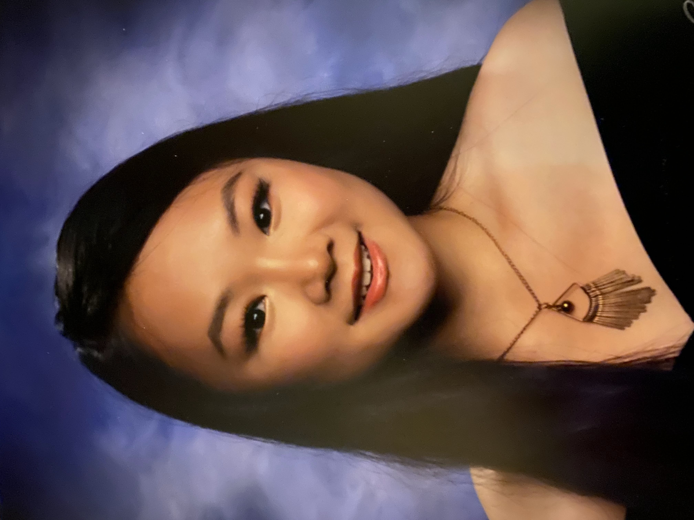

# Maggie's User Page
## Table of Contents

1. [Brief Introduction](#introduction)
2. [Get to Know Me](#get-to-know-me)
3. [Connect with Me](#connect-with-me)
## Introduction
Hello! I am Maggie Liu, a third-year CS major and am minoring in business. In my college journey, I hope to make many **life-long** friends, **travel** abroad, and gain extensive **technical** working experience.

## Get to Know Me
### Favorite Hobbies
I like going out on **long walks** and listening to music. On my promenades, I usually daydream about made-up conversations where I debate myself on different topics and figure out what my answer would be. I also **journal** from time to time just because I want to save my experiences for my children to look back on, if they are ever curious. And I also like cooking. It's a great way to test my courage by trying new recipes and working under a time crunch.
### Favorite Quote
I don't usually think in terms of quotes, but one quote that stuck with me through a *particularly* rough year in high school was by a man named Ben Francia. I have no idea who he is, but I will always remember the quote:
> "It's gonna get harder before it gets easier. But it will get better, you just gotta make it through the hard stuff first."

At first glance, it might seem like another cheesy motivation quote du jour, but the hope that things are hard now so that things later get better got me through some *bad* days.

### Favorite Line of Code
`System.out.println()`

This line resonates **so** deeply with my identity as a programmer, I cannot help but include it. This single line of code has worked me through hundreds of coding errors in the debugging process. My best friend and savior.

### Personal Strengths
1. I like to make long-term plans, which I do my best to follow and execute over time. 
2. I like to be thorough when I am exposed to new things; consequently I ask a lot of questions.
   
### Personal Weaknesses
1. At times, I can be a little rigid on plans that I've made. 
2. I can be easily intimidated by large, vague tasks (so programming assignments are a blast...). 

### Dream Goals
- Become a software engineer product manager
- Make 6 figures
- Buy my [dream home](https://assets.architecturaldesigns.com/plan_assets/324992227/large/86053BW_1-nu_1568236260.jpg)
- Travel through Europe 

### Goals for this year
- [ ] Get a summer internship
- [ ] Get a CAPM certificate
- [ ] Make plans for studying abroad

## Connect With Me
Let's be friends! Connect with me on [LinkedIn](https://www.linkedin.com/in/maggie-liu-26aa53228).
